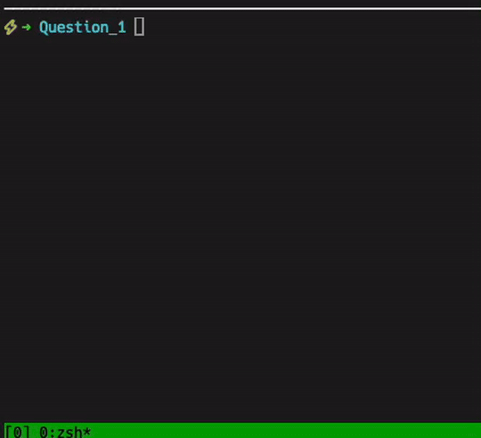

# Question 1: Multithreading
### How to run it
If you dont have  python interpreter installed:
1. For Mac OS 
```sh
brew install python
```
2. For Linux  OS 
```sh
sudo apt update
sudo apt install python3
```

Go inside the Question_1/ folder and run the following:
```sh
python3 main.py
```


### Description and directory  structure 
```sh
.
├── Readme.md
├── __init_.py
├── core
│   ├── __init__.py
│   ├── __pycache__
│   ├── consumer.py
│   └── producer.py
└── main.py
3 directories, 6 files
```
**Note** : I decided to create a **consumer and a producer class**  in the **consumer.py** and **producer.py** files, thinking that those classes would get more functionality in the future, besides from only 'consuming' and 'producing'. I only leave the main.py (main process) file to create , execute and manage the lifecycle of  the threads.


## Some considerations 
Because of the use of multithreading  there a some overhead considerations
#### Global interpreter Lock: 
The GIL prevents the use of multiple CPU cores. So python threads only can use a single cpu core, this can lead to inefficiencies.
#### Context Switching between threads:
When switching between the two threads **consumer thread** and **producer thread** context it can lead to an overhead. Because the OS must save and restore the state each time.
#### Synchronization Costs
The use of **Queue** class as a shared queue might lead to some overhead. Mainly because there are some locks that the class use internally.
#### 10 seconds Rule 
Because this smalls overheads tend to add it everytime the consumer.consume and producer.produce functions are executed. There is not 100% accurate in the 0.1 seconds mark or the 0.15 seconds mark. This lead to in some cases the threads to be shutdown before it gets to 10 seconds. 
For example the program terminate at 9.85s.

